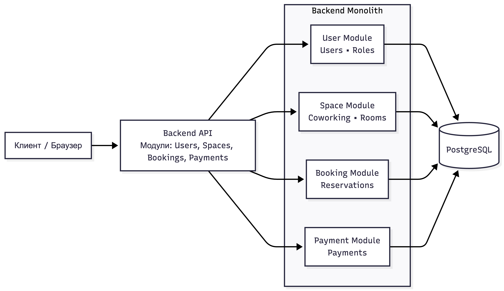

# Coworking Manager

Backend-сервис для управления коворкингом.

---

## О проекте

**Coworking Manager** — это backend-приложение для автоматизации процессов коворкинга, проект реализует бронирование рабочих мест и переговорных, управление пользователями и ролями, тарифами и расписанием, а также бизнес-логику проверки пересечений и расчёта стоимости.


---

## Архитектура

Проект построен с разделением ответственности на слои (Layered Architecture/Clean Architecture).

---

## Схема архитектуры



---

## Технологический стек


---

## Запуск проекта

### 1. Клонирование репозитория и запуск локально

```bash
git clone https://github.com/IslamCHup/coworking-manager-project.git
cd coworking-manager-project
go mod download
go run ./cmd/api/main.go
```
### 2. Запуск через Docker
```bash
docker build -t coworking-manager .
docker run -p 8080:8080 --env-file .env coworking-manager
```
### 3. Запуск через Makefile

```bash
make build          # Собрать приложение
make run            # Запустить приложение
```

---

## Конфигурация

Параметры приложения настраиваются через переменные окружения. В корне есть пример .env файла.

---

## Мой вклад

**Моя часть реализации проекта**
- Реализовал backend-систему бронирования рабочих мест с бизнес-валидациями (время, конфликты, статус, стоимость);
- Разработал систему управления балансом пользователя с атомарными транзакциями и автоматическим списанием/возвратом средств
- Реализовал фильтрацию, сортировку и пагинацию бронирований
- Внедрил Redis-кэширование (cache-aside) с инвалидацией и логированием HIT/MISS
- Спроектировал слоистую архитектуру (Handler → Service → Repository)
- Реализовал CRUD и управление статусами бронирований
- Внедрил структурированное логирование (`slog`);
- Настроил JWT-аутентификацию и валидацию прав доступа
- Оптимизировал производительность запросов (индексы, пагинация, кэш)

**Оптимизация производительности запросов /booking**

- Было: ~300 мс при 10 000 записей
- Убраны лишние циклы, `PRELOAD` заменён на `JOIN` и исключён из дефолтного сценария(вынес в фильтр)
- Узкие места выявлены с помощью `pprof`
- Добавлены составные и GiST-индексы (`tsrange / tstzrange`)
- Настроен пул соединений (`MaxOpenConns`, `MaxIdleConns`)
- Время ответа снижено до ~38 мс
- Добавил Redis-кэширование: 5–8 мс при 1 000 записей

---

## Контакты

-  Email: [islam.ch@mail.ru](mailto:islam.ch@mail.ru)
- GitHub: [@IslamCHup](https://github.com/IslamCHup)
<br><br>

**Команда**
<br>
[Идигов Байсангур](https://github.com/Idigov)<br>
[Дени](https://github.com/Sterling95)

---


