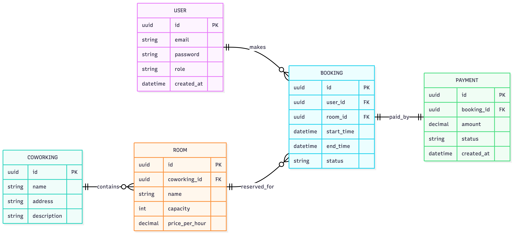

# Coworking Manager

Backend-сервис для управления коворкингом: бронирование рабочих мест и переговорных, управление пользователями, тарифами и расписанием.

Проект реализован на **Go** с использованием модульной архитектуры и ориентирован на масштабирование и дальнейшее развитие.

---

## 📌 Содержание

- [О проекте](#о-проекте)
- [Функциональность](#функциональность)
- [Архитектура](#архитектура)
- [ER-диаграмма и схема БД](#er-диаграмма-и-схема-бд)
- [Технологический стек](#технологический-стек)
- [Запуск проекта](#запуск-проекта)
- [Конфигурация](#конфигурация)
- [Тестирование](#тестирование)
- [Структура проекта](#структура-проекта)
- [Планы по развитию](#планы-по-развитию)

---

## 🧠 О проекте

**Coworking Manager** — это backend-приложение для автоматизации процессов коворкинга:
- учет пользователей и ролей
- управление рабочими местами и комнатами
- бронирование и расписание
- подготовка базы для интеграции с frontend и внешними сервисами

Проект может использоваться как учебный материал, pet-project или основа для реального продукта.

---

## ⚙️ Функциональность

### Реализовано

- 👤 Управление пользователями
- 🪑 Управление рабочими местами
- 🗓️ Бронирование (резервации)
- 🏢 Управление пространствами и зонами
- 📊 Базовая бизнес-логика
- 🧪 Модульные тесты
- 🐳 Поддержка Docker

### Планируется

- 🔐 Роли и права доступа
- 💳 Тарифы и абонементы
- 💰 Система платежей
- 🔌 REST / GraphQL API
- 📝 Логирование и метрики

---

## 🏗️ Архитектура

Проект построен с разделением ответственности на слои (Layered Architecture / Clean Architecture):

- `cmd` — точки входа приложения
- `internal` — основная бизнес-логика
  - `service` — бизнес-правила и расчеты
  - `repository` — работа с базой данных
  - `model` — доменные модели
- `handler` — HTTP / API слой (при расширении)

Такой подход обеспечивает:
- Независимое тестирование каждого слоя
- Легкость добавления новых функций
- Возможность смены хранилища данных

---

## 🗄️ ER-диаграмма и схема БД

### Основные сущности

- **User** — пользователи системы
- **Workspace** — рабочие пространства
- **Room** — переговорные комнаты
- **Booking** — бронирования и резервации
- **Tariff** — тарифные планы



---

## 🧰 Технологический стек


- **Go 1.21+** — основной язык программирования
- **PostgreSQL** — база данных (планируется)
- **Docker & Docker Compose** — контейнеризация
- **Go modules** — управление зависимостями
- **Testing** — встроенный пакет тестирования Go
- **Makefile** — автоматизация задач

---

## 🚀 Запуск проекта

### Предварительные требования

- Go 1.21 или выше
- Docker и Docker Compose (опционально)
- PostgreSQL (для локального развития)
- Git

### 1. Клонирование репозитория

```bash
git clone https://github.com/your-username/coworking-manager-project.git
cd coworking-manager-project
```

### 2. Запуск через Docker Compose (рекомендуется)

```bash
docker-compose up --build
```

### 3. Локальный запуск

```bash
# Скачать зависимости
go mod download

# Запустить приложение
go run ./cmd/main.go
```

### 4. Запуск через Docker (изолированно)

```bash
docker build -t coworking-manager .
docker run -p 8080:8080 --env-file .env coworking-manager
```

---

## ⚙️ Конфигурация

Параметры приложения настраиваются через переменные окружения.

### Пример файла `.env`

```env
# Database
DB_HOST=localhost
DB_PORT=5432
DB_USER=postgres
DB_PASSWORD=postgres
DB_NAME=coworking

# Server
SERVER_PORT=8080
SERVER_HOST=0.0.0.0

# Environment
ENVIRONMENT=development
```

Создайте файл `.env` в корне проекта перед запуском.

---

## 🧪 Тестирование

### Запуск всех тестов

```bash
go test ./... -v
```

### Проверка покрытия кода

```bash
go test ./... -cover
go tool cover -html=coverage.out
```

### Запуск тестов конкретного пакета

```bash
go test ./internal/service -v
```

### Запуск с бенчмарками

```bash
go test ./... -bench=. -benchmem
```

---

## 📁 Структура проекта

```
.
├── cmd/                              # Точки входа
│   └── main.go                       # Основной entry point
├── internal/                         # Внутренняя логика (не экспортируется)
│   ├── service/                      # Слой бизнес-логики
│   │   ├── user_service.go
│   │   ├── booking_service.go
│   │   └── workspace_service.go
│   ├── repository/                   # Слой доступа к данным
│   │   ├── user_repository.go
│   │   ├── booking_repository.go
│   │   └── workspace_repository.go
│   └── model/                        # Доменные модели
│       ├── user.go
│       ├── booking.go
│       └── workspace.go
├── tests/                            # Интеграционные тесты
│   └── integration_test.go
├── docs/                             # Документация
│   ├── ER-диаграмма.md
│   └── API.md
├── .dockerignore                     # Исключения для Docker
├── .env.example                      # Шаблон переменных окружения
├── .gitignore
├── Dockerfile                        # Docker конфигурация
├── docker-compose.yml                # Docker Compose конфигурация
├── Makefile                          # Автоматизация задач
├── go.mod
├── go.sum
└── README.md
```

---

## 📝 Makefile команды

Основные команды для разработки:

```bash
make build          # Собрать приложение
make run            # Запустить приложение
make test           # Запустить тесты
make coverage       # Показать покрытие
make docker-build   # Собрать Docker образ
make docker-run     # Запустить контейнер
make clean          # Очистить временные файлы
make lint           # Проверить код (если настроено)
```

---

## 🛣️ Планы по развитию

### Фаза 1 (текущая)
- ✅ Базовые модели данных
- ✅ Слой сервисов и репозиториев
- ⏳ Миграции базы данных

### Фаза 2
- 🔐 Система аутентификации (JWT)
- 👥 Роли и права доступа
- 📋 REST API endpoints

### Фаза 3
- 💳 Система тарифов и платежей
- 📊 Аналитика и отчеты
- 📧 Email уведомления

### Фаза 4
- 🔌 GraphQL API
- 📱 WebSocket для real-time обновлений
- 🧪 E2E тесты

---

## 🤝 Контрибьютинг

Если вы хотите внести свой вклад:

1. Fork репозиторий
2. Создайте ветку для вашей функции (`git checkout -b feature/amazing-feature`)
3. Commit изменений (`git commit -m 'Add amazing feature'`)
4. Push в ветку (`git push origin feature/amazing-feature`)
5. Откройте Pull Request

---

## 📞 Контакты

- 📧 Email: [islam.ch@mail.ru](mailto:islam.ch@mail.ru)
- 🐙 GitHub: [@IslamCHup](https://github.com/IslamCHup)

---